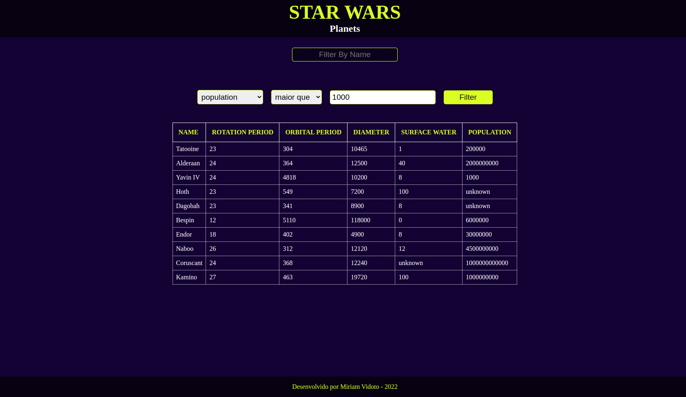

# Boas-vindas ao repositório do projeto Star Wars Planets Search!

Este foi um projeto realizado durante o meu curso  na Trybe.

Foi desenvolvido uma aplicação contendo uma lista com filtros de planetas do universo de Star Wars usando Context API e Hooks para controlar os estados globais. 

https://miriamvidoto.github.io/project-starwars-planets/search/

Nessa aplicação, a pessoa usuária poderá:

  * Filtrar os dados da tabela de acordo com a coluna correspondente e com os valores escolhidos através de três seletores.
  *  Ordenar as colunas de forma ascendente ou descendente;
  * Remover todas filtragens;

Foi utilizado TDD durante o desenvolvimento de todo o projeto.

 Nesse projeto, eu aprimorei minhas habilidades de:

 * Utilizar a _Context API_ do **React** para gerenciar estado.
 * Utilizar o _React Hook useState_;
 * Utilizar o _React Hook useContext_;
 * Utilizar o _React Hook useEffect_;
 * Criar _React Hooks_ customizados.

